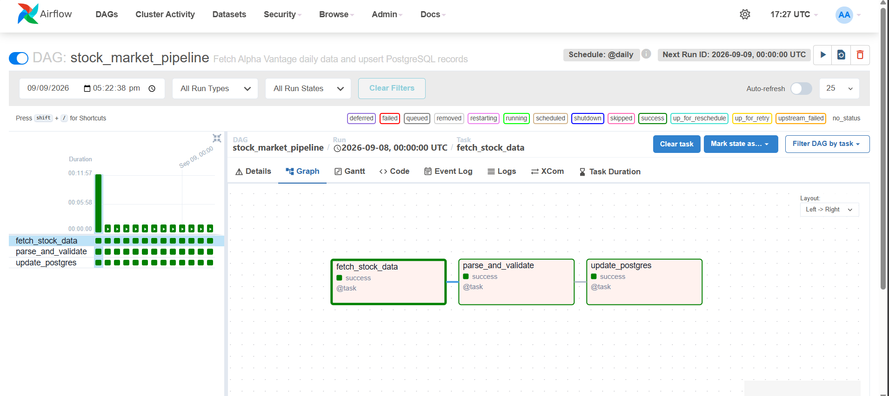

# 8byte Stock Market Data Pipeline

Dockerized stock market data pipeline built for the 8byte AI Engineering Internship assessment.

The pipeline uses Apache Airflow to fetch daily stock data from Alpha Vantage, validate the response, and store the data in PostgreSQL.

## Tech Stack

- Python
- Apache Airflow
- PostgreSQL
- Docker / Docker Compose
- Alpha Vantage API
- requests
- pytest

## How it works

The Airflow DAG has three tasks:

1. Fetch stock data from Alpha Vantage
2. Parse and validate the response
3. Insert or update the records in PostgreSQL

The database uses `(symbol, price_date)` as the primary key, so running the pipeline multiple times does not create duplicate records.

## Pipeline in Action

### Airflow DAG



The DAG runs three steps: fetching the stock data, validating the response, and updating PostgreSQL.

## Project Structure

```text
8bytes/
├── dags/
│   └── stock_pipeline.py
├── src/
│   ├── database.py
│   ├── fetch.py
│   └── transform.py
├── tests/
│   ├── test_database.py
│   ├── test_fetch.py
│   └── test_transform.py
├── sql/
│   └── init.sql
├── docs/
│   └── airflow-dag.png
├── Dockerfile
├── docker-compose.yml
├── requirements.txt
├── .env.example
├── .gitignore
└── README.md
```

## Configuration

Create a `.env` file from `.env.example` and add your values.

Required variables:

```text
STOCK_API_KEY=your_api_key
STOCK_SYMBOL=AAPL

POSTGRES_DB=stock_pipeline
POSTGRES_USER=stock_user
POSTGRES_PASSWORD=your_password

AIRFLOW_ADMIN_USERNAME=admin
AIRFLOW_ADMIN_PASSWORD=your_password
```

The `.env` file is ignored by Git and should not be committed.

## Run

Make sure Docker Desktop is running.

Build and start the complete pipeline with:

```bash
docker compose up --build
```

Airflow will be available at:

```text
http://localhost:8080
```

Log in using the Airflow credentials configured in `.env`.

Enable the `stock_market_pipeline` DAG and trigger it manually, or let the configured schedule run it.

## Check the Data

To open a PostgreSQL shell:

```bash
docker compose exec postgres psql -U stock_user -d stock_pipeline
```

Then run:

```sql
SELECT *
FROM stock_prices
ORDER BY price_date DESC
LIMIT 10;
```

You can also check the number of stored records:

```sql
SELECT COUNT(*) FROM stock_prices;
```

## Error Handling

The pipeline handles:

- API request timeouts
- HTTP errors
- Invalid JSON responses
- API/provider errors
- Missing stock data
- Invalid dates and numeric values
- Invalid OHLC relationships
- PostgreSQL errors with rollback

Airflow retries failed tasks automatically.

## Tests

Run the tests with:

```bash
python -m pytest -q
```

The tests mock API and database calls, so they do not require a live Alpha Vantage request.

## Database

The `stock_prices` table stores:

- symbol
- price_date
- open
- high
- low
- close
- volume
- fetched_at

The combination of `symbol` and `price_date` is the primary key.

The pipeline uses PostgreSQL UPSERT logic with `ON CONFLICT`, so running the pipeline again updates existing records instead of creating duplicates.

## Scheduling

The default schedule is `@daily`.

It can be configured using:

```text
STOCK_SCHEDULE=@daily
```

The daily schedule is used because the Alpha Vantage free tier has API request limits.

## Notes

The pipeline currently processes the stock symbol configured through `STOCK_SYMBOL`.

The code is separated into fetching, transformation, and database modules so each part can be tested independently.

For multiple stock symbols, the DAG can be extended to process symbols independently.